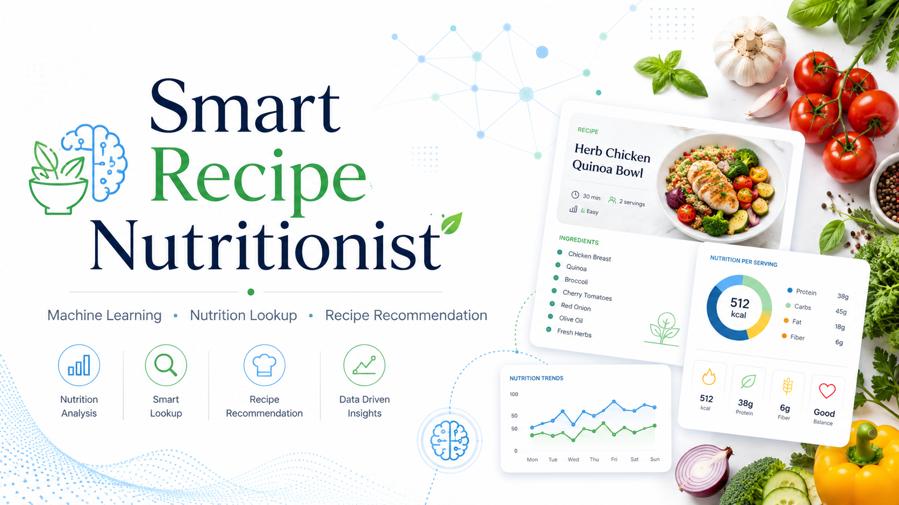
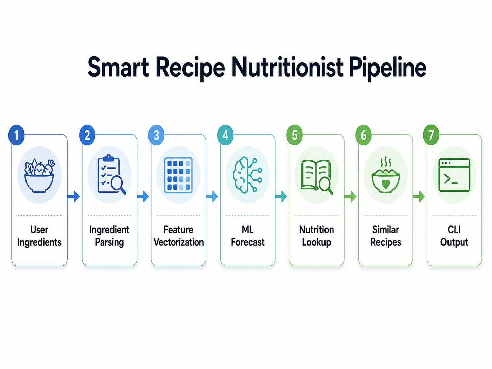
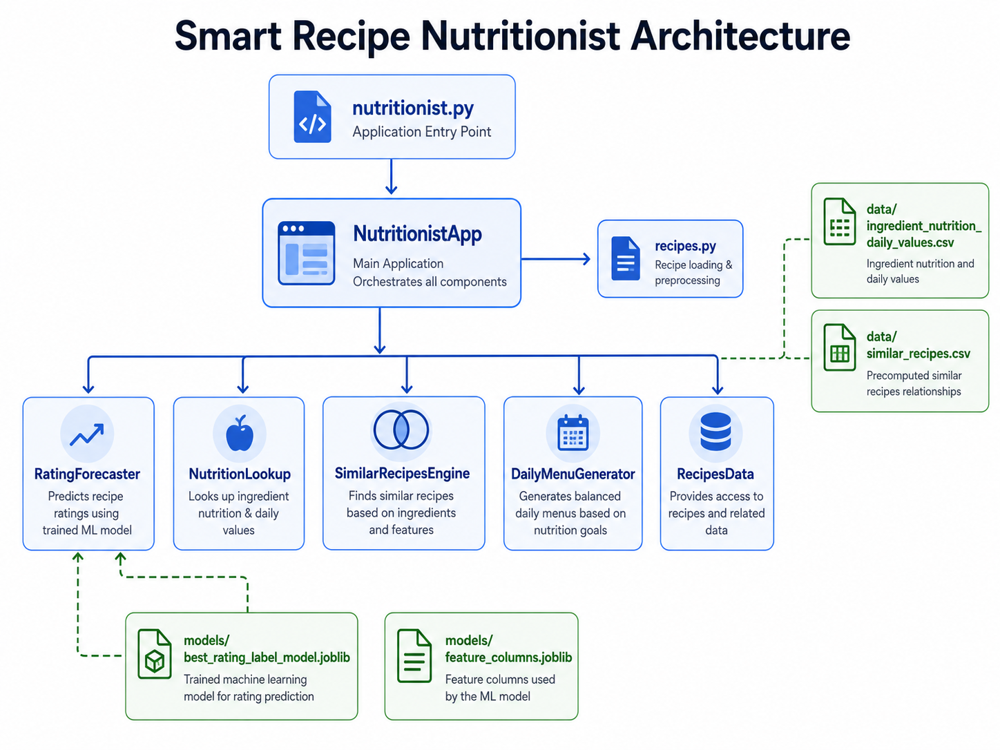

# Smart Recipe Nutritionist



**Python** · **Machine Learning** · **CLI App** · **Nutrition Lookup** · **Recipe Recommendation** · **Pytest** · **Portfolio Project**

## Overview

Smart Recipe Nutritionist is a Python command-line application that helps users evaluate ingredient combinations, explore nutrition facts, find similar recipes, and generate simple daily menus.

The project combines a trained machine learning model, recipe similarity search, local nutrition data, optional USDA API fallback, automated tests, and structured command-line output.

This project was originally developed as part of a School 21 Russia programming assignment and later reorganized into a professional portfolio project.

## Table of Contents

- [Overview](#overview)
- [Project Objective](#project-objective)
- [Main Features](#main-features)
- [How It Works](#how-it-works)
- [Repository Structure](#repository-structure)
- [Required Data and Models](#required-data-and-models)
- [Installation](#installation)
- [Usage](#usage)
- [Testing](#testing)
- [Core Components](#core-components)
- [Notebook](#notebook)
- [Documentation](#documentation)
- [Skills Demonstrated](#skills-demonstrated)
- [Limitations](#limitations)
- [Future Improvements](#future-improvements)
- [License](#license)
- [Author](#author)

## Project Objective

The goal of this project is to build a practical Python application that can:

- predict whether a combination of ingredients is likely to work well;
- provide nutrition facts for user-provided ingredients;
- recommend similar recipes based on ingredient similarity;
- generate a simple daily menu;
- demonstrate a complete ML-powered CLI workflow;
- show clean, testable, object-oriented Python code.

Unlike a notebook-only project, this repository contains a runnable command-line application with tests and documentation.

## Main Features

The application supports two main modes.

### Ingredient Forecast Mode

Given ingredients such as:

```text
chicken, tomato, garlic
```

the app returns:

```text
I. OUR FORECAST
II. NUTRITION FACTS
III. TOP-3 SIMILAR RECIPES
```

### Daily Menu Mode

The app can also generate:

```text
BREAKFAST
LUNCH
DINNER
```

with recipe titles, ingredients, nutrition values, ratings, and URLs.

## How It Works

High-level application workflow:



```text
User ingredients
        ↓
Ingredient parsing
        ↓
Feature vectorization
        ↓
ML model prediction
        ↓
Nutrition lookup
        ↓
Similar recipe search
        ↓
Formatted CLI output
```

Daily menu workflow:

```text
Processed recipe dataset
        ↓
Meal type inference
        ↓
Recipe nutrition lookup
        ↓
Recipe scoring
        ↓
Breakfast / lunch / dinner selection
        ↓
Formatted daily menu
```

## Repository Structure

```text
smart-recipe-nutritionist/
│
├── README.md
├── .gitignore
├── requirements.txt
├── LICENSE
│
├── assets/
│   ├── project_banner.png
│   ├── pipeline_diagram.png
│   └── app_architecture.png
│
├── src/
│   ├── nutritionist.py
│   └── recipes.py
│
├── notebooks/
│   └── recipes.ipynb
│
├── data/
│   ├── README.md
│   ├── ingredient_nutrition_daily_values.csv
│   └── similar_recipes.csv
│
├── models/
│   ├── README.md
│   ├── best_rating_label_model.joblib
│   └── feature_columns.joblib
│
├── tests/
│   └── test_recipes.py
│
├── docs/
│   ├── project_overview.md
│   ├── model_pipeline.md
│   └── usage_guide.md
│
└── reports/
    └── analysis_summary.md
```

## Required Data and Models

To run the application, the following files are required:

```text
data/ingredient_nutrition_daily_values.csv
data/similar_recipes.csv
models/best_rating_label_model.joblib
models/feature_columns.joblib
```

These processed files and model artifacts are included so that the application can run without requiring the raw training dataset.

The raw dataset file is not included:

```text
data/epi_r.csv
```

That file is only needed for experimentation or rebuilding the data/model pipeline from scratch.

## Installation

### 1. Clone the repository

```bash
git clone https://github.com/Luis99fer/smart-recipe-nutritionist.git
cd smart-recipe-nutritionist
```

### 2. Create a virtual environment

Windows PowerShell:

```powershell
python -m venv .venv
.venv\Scripts\Activate.ps1
```

macOS/Linux:

```bash
python -m venv .venv
source .venv/bin/activate
```

### 3. Install dependencies

```bash
pip install -r requirements.txt
```

## Usage

### Ingredient Forecast

Run:

```bash
python src/nutritionist.py chicken, tomato, garlic
```

You can also use a quoted comma-separated string:

```bash
python src/nutritionist.py "chicken, tomato, garlic"
```

Expected output structure:

```text
I. OUR FORECAST
This looks like a great combination. We think it has a strong chance to become a tasty dish.

II. NUTRITION FACTS
Chicken
Protein - 62% of Daily Value

III. TOP-3 SIMILAR RECIPES:
- Recipe Title, rating: 4.5, URL:
https://example.com/recipe
```

Actual output depends on the saved model, local nutrition data, and processed recipe dataset.

### Daily Menu

Run:

```bash
python src/nutritionist.py --menu
```

Expected output structure:

```text
BREAKFAST
---------------------
Recipe title
Ingredients:
- ingredient
Nutrients:
- protein: 25%
URL: https://example.com

LUNCH
---------------------

DINNER
---------------------
```

## Testing

The project includes automated tests for the main non-model utility logic.

Test file:

```text
tests/test_recipes.py
```

The tests cover:

- Epicurious URL generation;
- CLI ingredient parsing;
- local nutrition CSV lookup;
- missing ingredient behavior;
- ingredient column detection;
- recipe ingredient extraction;
- similar recipe search;
- daily menu meal-type inference;
- daily menu ingredient cleaning;
- daily menu output formatting.

Run tests with:

```bash
python -m pytest tests -v
```

On Windows, if `pytest` has permission issues with the default temporary directory, run:

```powershell
mkdir .pytest_tmp -Force
python -m pytest tests -v --basetemp=".pytest_tmp"
```

You can also check source syntax with:

```bash
python -m py_compile src/recipes.py
python -m py_compile src/nutritionist.py
```

## Optional USDA API Fallback

The app first checks local nutrition data from:

```text
data/ingredient_nutrition_daily_values.csv
```

If an ingredient is not found locally, the app can optionally use the USDA FoodData Central API.

The API key must be configured as an environment variable.

Windows PowerShell:

```powershell
$env:USDA_API_KEY="your_api_key_here"
```

macOS/Linux:

```bash
export USDA_API_KEY="your_api_key_here"
```

The API key must not be hardcoded or committed to GitHub.

## Core Components

The main application logic is implemented in:

```text
src/recipes.py
```

The CLI entry point is:

```text
src/nutritionist.py
```



### RecipesData

Loads recipe datasets and detects binary ingredient columns.

### NutritionLookup

Retrieves nutrition facts from a local CSV file or optionally from the USDA API.

### SimilarRecipesEngine

Finds similar recipes using cosine similarity between ingredient vectors.

### RatingForecaster

Loads the trained model and predicts the quality label of an ingredient combination.

### DailyMenuGenerator

Generates breakfast, lunch, and dinner suggestions using recipe rating and nutrition data.

### NutritionistApp

Connects all components into one high-level application interface.

## Notebook

The development notebook is located in:

```text
notebooks/recipes.ipynb
```

It documents the experimentation workflow used during the School 21 task and project development.

Depending on the notebook workflow, the optional raw dataset may be needed:

```text
data/epi_r.csv
```

The raw dataset is not required for normal CLI usage.

## Documentation

Additional documentation is available in:

| File | Description |
|---|---|
| `docs/project_overview.md` | General explanation of the project. |
| `docs/model_pipeline.md` | Technical explanation of the app pipeline. |
| `docs/usage_guide.md` | Local setup and usage instructions. |
| `data/README.md` | Data file requirements and notes. |
| `models/README.md` | Model artifact description. |
| `reports/analysis_summary.md` | Summary of analysis and capabilities. |

## Skills Demonstrated

This project demonstrates:

- Python programming;
- command-line application development;
- machine learning model inference;
- scikit-learn model loading;
- joblib model persistence;
- pandas data processing;
- NumPy vector operations;
- cosine similarity recommendation;
- API fallback design;
- environment variable handling;
- data preprocessing;
- modular object-oriented design;
- automated testing with pytest;

## License

This project is licensed under the MIT License.

The license applies to the code and documentation in this repository.

External datasets, recipe sources, and APIs are subject to their own terms and conditions.

## Author

**Luis Fernando Avalos Guzman**

GitHub: [Luis99fer](https://github.com/Luis99fer)